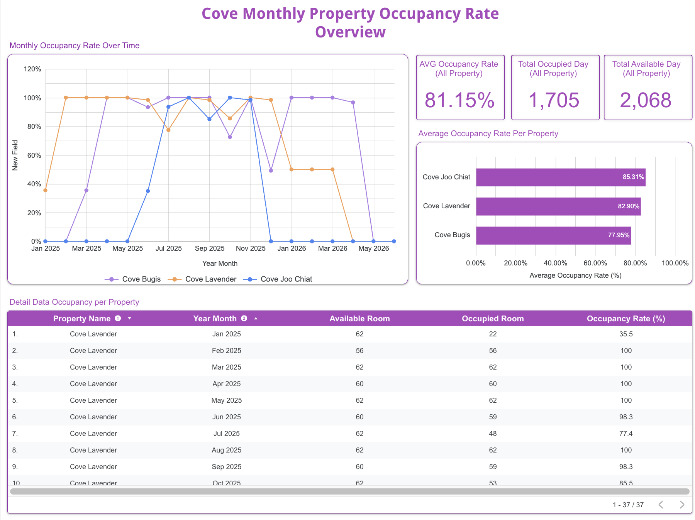

# Cove Senior Data Engineer Assignment

## Overview
This repository contains the ELT pipeline for the Cove property management system data challenge. The pipeline transforms raw JSONL MongoDB exports (properties, rooms, tenancies) into a clean, analytical structure using **dbt** (Data Build Tool) and **Google BigQuery**. 

The ultimate business objective of this pipeline is to accurately calculate the **Monthly Occupancy Rate by Property**.

## Architecture
The pipeline follows the **Medallion Architecture**:
- **Bronze (Staging):** Type casting, basic renaming, and ingestion of raw data.
- **Silver (Conformed):** Expanding lease dates and occupancies into daily granularity (a Calendar Spine) to handle cross-month lease logic accurately.
- **Gold (Marts):** Final aggregations and metrics computation for downstream BI consumption (e.g., Looker Studio).

## Final Result (Dashboard)
The materialized gold layer tables were directly connected to Looker Studio to produce the requested visualizations:
Link : https://datastudio.google.com/s/kXBhB_Ios8I

## Documentation Links
For detailed instructions and explanations, please refer to the documentation folder:
1. [Setup and Instructions](documentation/setup_instruction.md)
2. [Step-by-step Walkthrough & Approach](documentation/walkthrough.md)
3. [Notes, Assumptions, & Data Quality](documentation/notes_assumptions_data_quality.md)
