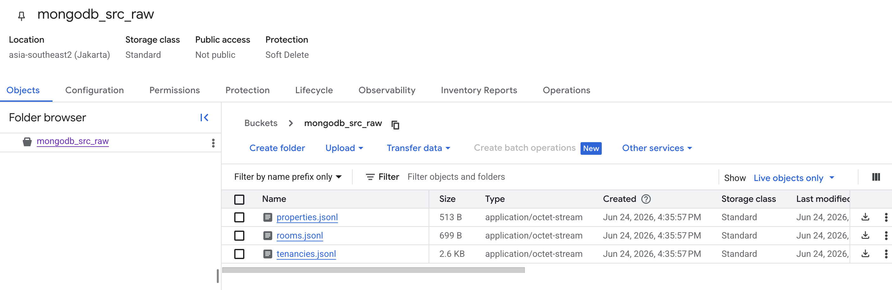
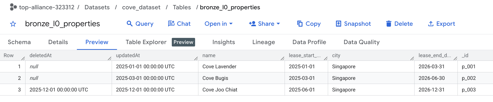
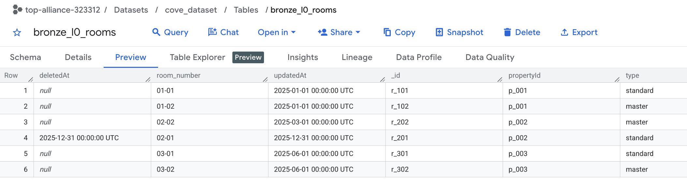
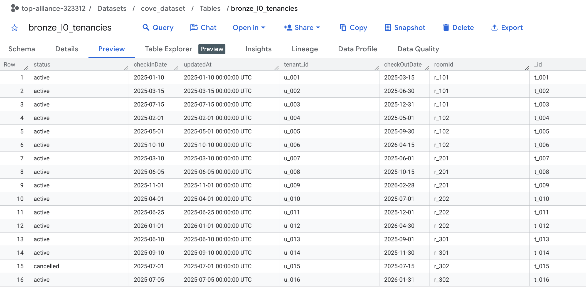
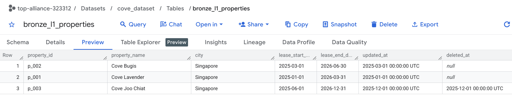
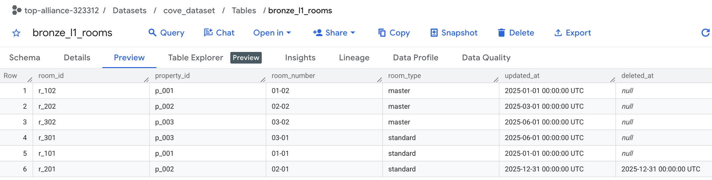
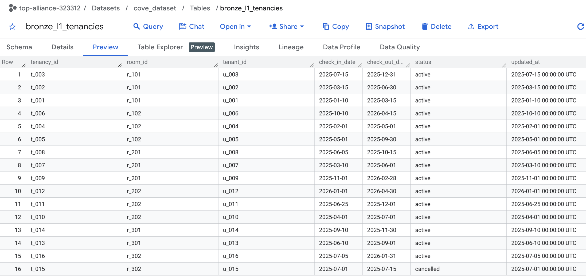
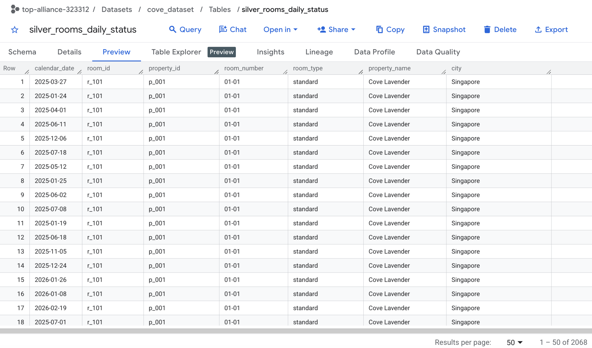
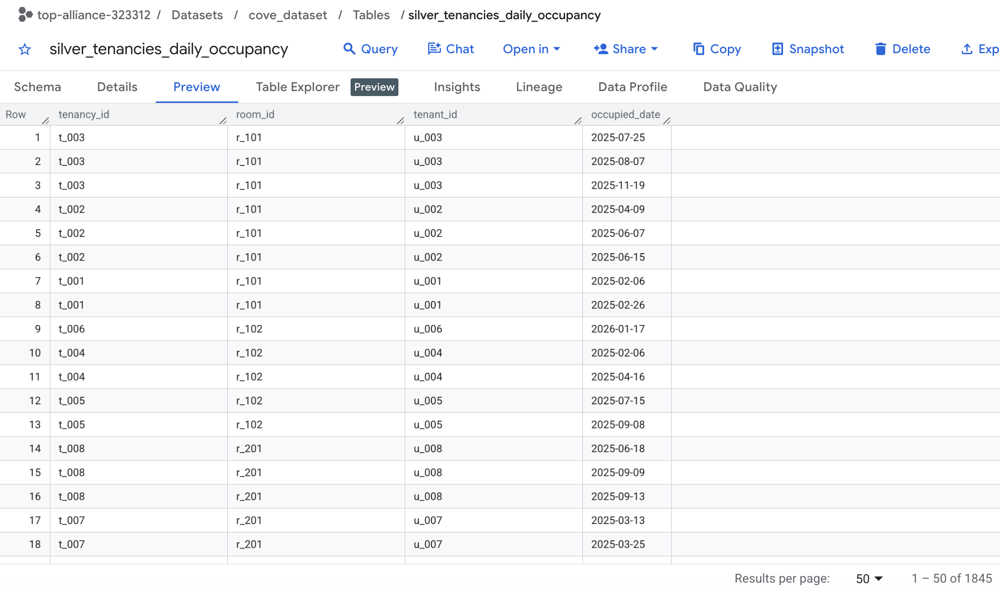
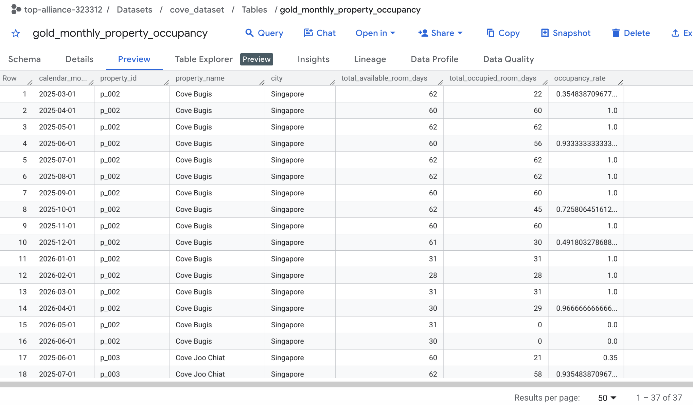

# Step-by-Step Guide & Approach

## The Problem
Calculating monthly occupancy rates (`Occupied Days / Available Days`) is complex when tenancies and property leases span across multiple months. It is difficult to accurately assign portions of a single lease to different calendar months using standard `DATE_DIFF` logic without writing complex CTE SQL logic.

## My Approach: The Daily Explosion (with helper Date Array/Calendar)
To solve this, I applied a daily expansion strategy in the **Silver layer**. By reducing all date ranges down to the individual day (1 record per day), aggregating them into calendar months becomes easier.

### 0. Pre-Bronze (Raw Data Ingestion)
The raw MongoDB exports were natively ingested into BigQuery.

### 1. Bronze Layer (Staging)
* **Models:** `bronze_l1_properties`, `bronze_l1_rooms`, `bronze_l1_tenancies`
* **Purpose:** Acts as a 1:1 reflection of the raw `cove_dataset` tables. I apply native BigQuery type casting (strings to dates/timestamps) and rename columns to standardize the naming convention (snake_case).

### 2. Silver Layer (Cleaned)
* **Models:** `silver_rooms_daily_status`, `silver_tenancies_daily_occupancy`
* **Purpose:** Explodes the data. 
    - **Rooms Daily Status:** I use BigQuery's `GENERATE_DATE_ARRAY` to generate a master calendar spanning the earliest to latest property lease dates. Then I perform a `CROSS JOIN` with the bronze rooms data, keeping only the days where the property lease is active and the room/property hasn't been deleted.
    - **Tenancies Daily Occupancy:** For all active tenancies, I explode the duration between `check_in_date` and the day *before* `check_out_date` into individual days.

### 3. Gold Layer (Business Marts)
* **Models:** `gold_monthly_property_occupancy`
* **Purpose:** Final Aggregation. I perform a `LEFT JOIN` from the generated available room days to the occupied tenancy days. I then deduplicate any overlapping edge cases, group by the property and calendar month, and simply count the total days.
    - `total_available_room_days`: Total physical room days existing in that month.
    - `total_occupied_room_days`: Total room days successfully joined to an active tenancy.
    - `occupancy_rate`: `total_occupied_room_days / total_available_room_days`.

